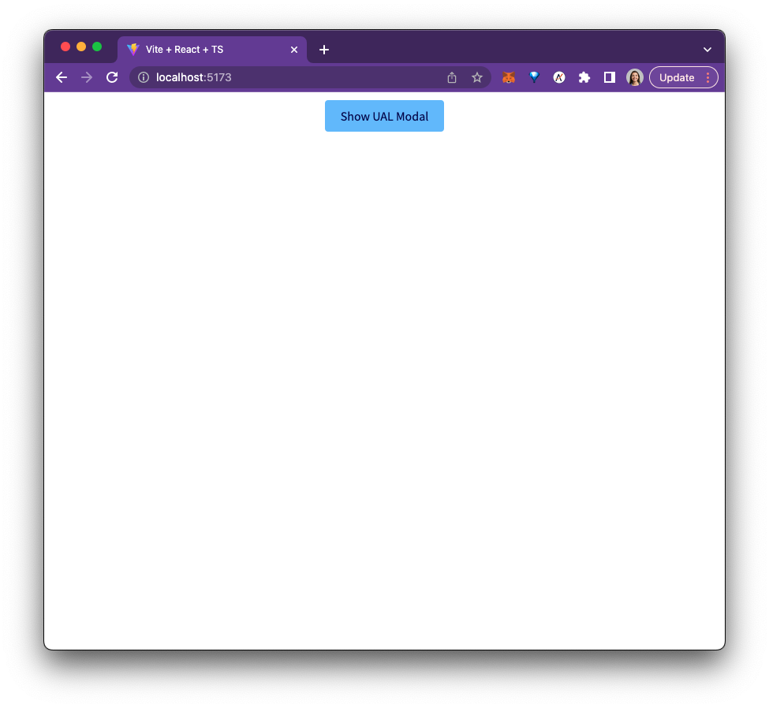
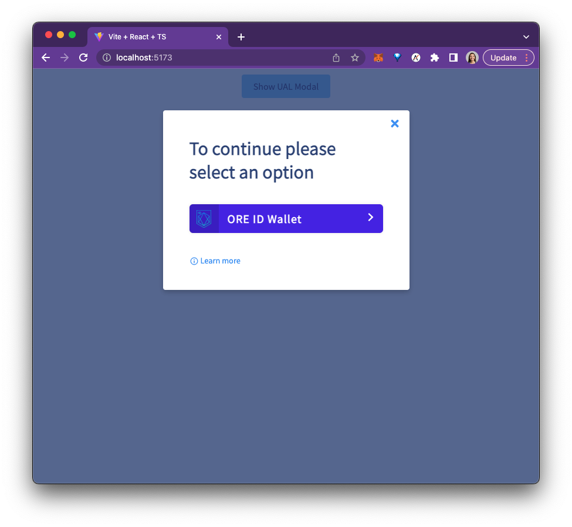
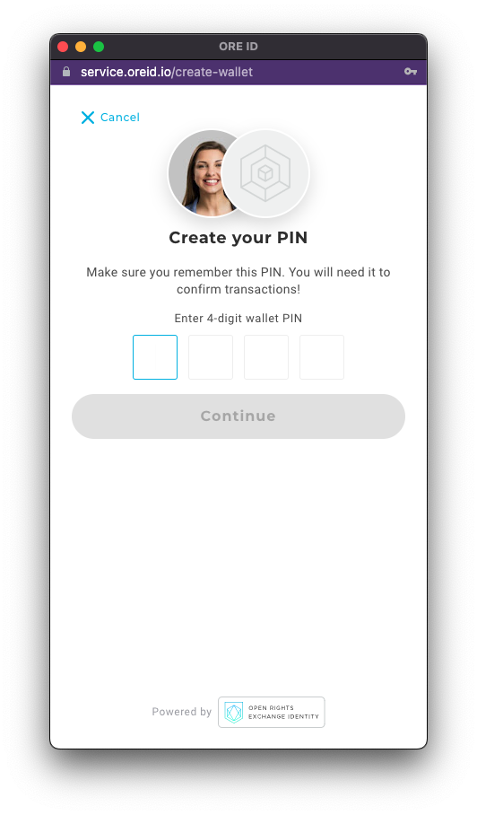
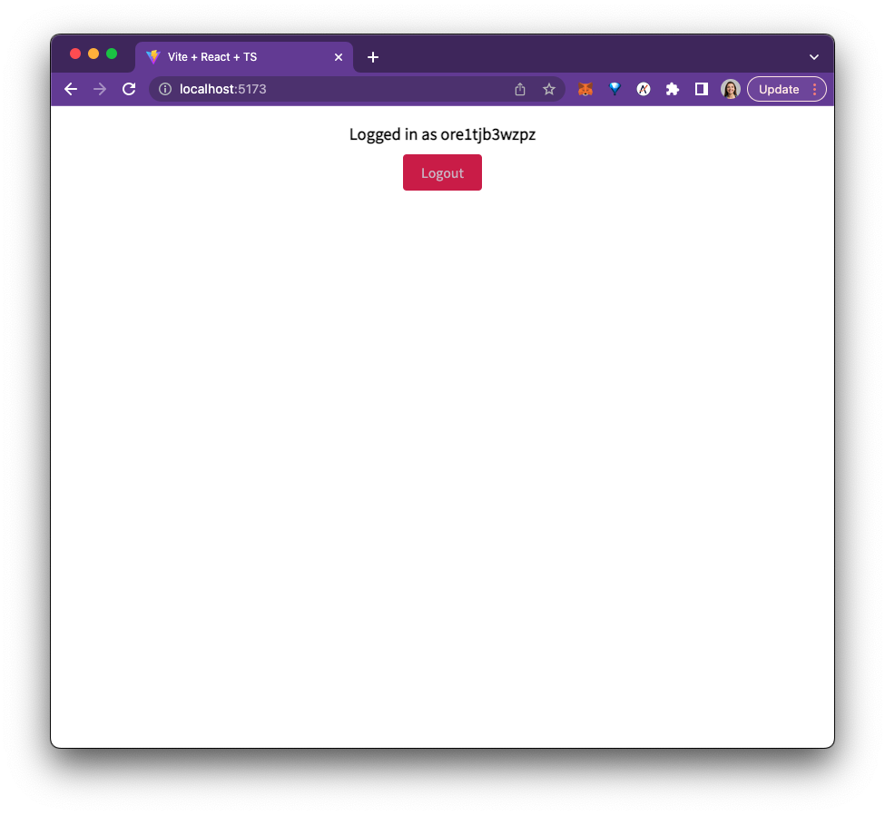
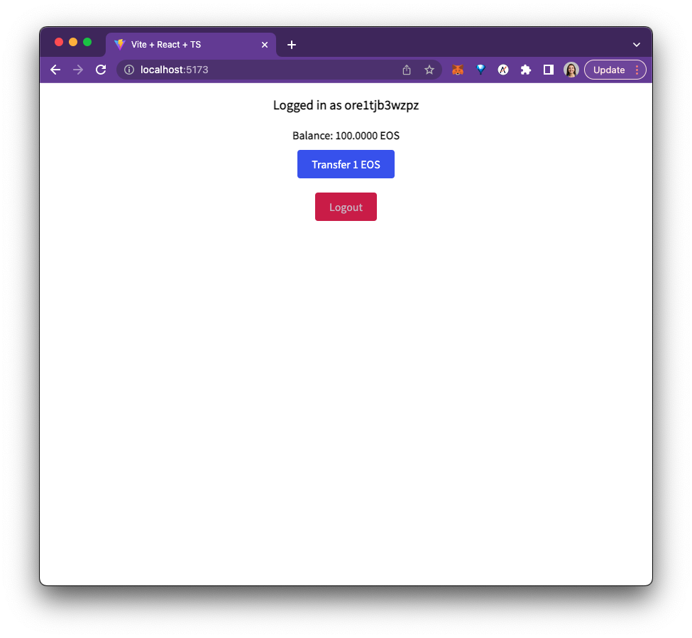
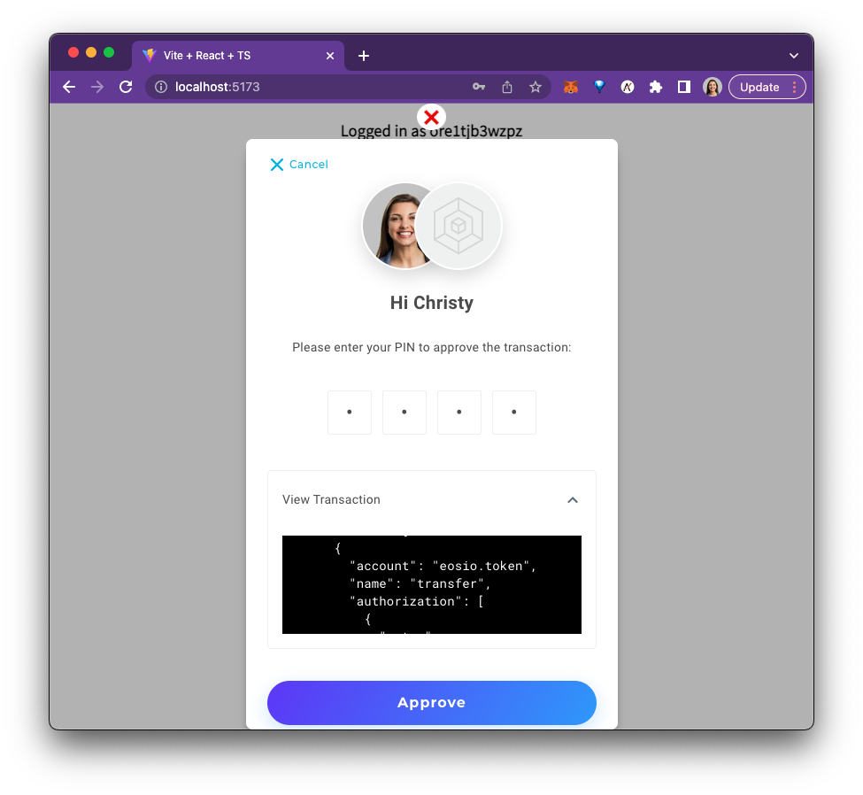

# UAL Authenticator Plugin for OREID

## Using the Authenticator Plugin

Our example app demonstrates login and transaction signing using OREID.
See `example/src/App.tsx` for a step by step walkthough see [this](./oreidUAL.md) documentation

## Build and Run

For testing purposes, this project is setup to link the ```authenticator/``` folder to the example app.  
You can check the ```example/package.json``` for how the ```ual-oreid``` is linked.

### Building the Authenticator Package
```shell
cd authenticator
yarn install
yarn run build
```

### Running the Example Application
```shell
cd example
yarn install
yarn run dev
```

### Using ual-oreid as an NPM Package
In practice, the NPM packaged version number will be used instead of the ```link=...``` value.  To use the published NPM package, in the file ```example/package.json``` change the ```ual-oreid``` package from ```link=...``` to the version number you want to use.


## Example App Functionality
> The EOS Kylin network is used in this example.
#### Login and Create Blockchain Account
1. Navigate to ```http:localhost:5173```. Launch the UAL Modal by clicking ```Show UAL Modal```.

    

2. Login using ORE ID Wallet

        
3. ORE ID will pop up a new window and present a field to enter your password for the wallet
4. Enter a password and click continue

    
5. Once the account creation is successful, the message ```"Logged in as ore1t....."``` will display.  This is your wallet address on the blockchain.

    

#### Fund Account
1. Add tokens to the account using a command to call an EOS Kylin Faucet.  Enter the wallet address into the ```to=``` field replacing ```ore1t...```.
    ```shell
    curl -X 'POST' \
    "https://faucet.eosnation.io/api/send?chain=kylin&to=ore1t..." \
    -H "accept: application/json" \
    -d "" 
   ```

2. The commandline should return a message success message simiiliar to the one below.
   ```shell
   {"message":"ok","transaction_id":"ea45815b113341c27b22614a43dbca9a8b569680abcd36e8c2d44a1c473fa234"}
   ```

#### Sample Transaction
1. Refresh the UAL app page ```localhost:5173```. Now, the page will have your balance.

    
2. Make a sample transaction by clicking ```Transfer 1 EOS```.
3. The ORE ID popup will open and ask you for the wallets password.

    
4. The transaction should be successful and now the balance displayed will reflect that.
5. Logout of the sample app with the ```Logout``` button.